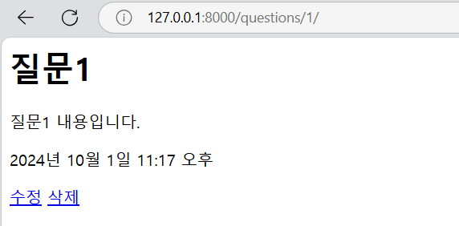
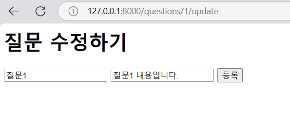

# Http Method - 수정, 삭제, 검색

## 1. Http Method

## 2. ORM 심화

### 장고 ORM 사용법

- `클래스이름.objects.all()` : 모든 테이블 정보를 객체로 만들어 리스트에 넣어 반환한다.
- `클래스이름.objects.get()` : 조건에 맞는 데이터를 객체로 만들어 반환한다.
- DB에 저장을 하고 싶을 때는 객체를 만들어 직접 저장한다.

  - Question()을 이용해 객체를 만든 후, 내용을 직접 채워넣고 `save()` 메서드로 저장한다.

  ```python
  elif request.method=='POST':
    question = Question()
    question.subject = request.POST['subject'],
    question.content = request.POST['content'],
    question.create_date = timezone.now()
    question.save()
  ```

  - Objects.create()를 이용하면 객체를 생성하고 `save()`하는 과정을 생략할 수 있다.
    ```python
    elif request.method=='POST':
    question = Question.objects.create(
      subject = request.POST['subject'],
      content=request.POST['content'],
      create_date=timezone.now()
    )
    ```

### 수정

: 저장되어 있는 값을 가져온 다음 필요한 값을 직접 수정하고 다시 저장해야 한다.

```python
question = Question.objects.get( id = question_id )

question.subject = request.POST['subject'],
question.content = request.POST['content'],
question.create_date = timezone.now()
question.save()

```

### 삭제

: 저장되어 있는 값을 가져온 다음 `delete()` 메서드만 사용하면 된다.

```python
question = Question.objects.get( id = question_id )

question.delete()
```

### 검색

- 제목이 '질문 1'인 질문을 가져오자.
  ```python
  questions = Question.objects.filter( subject = '질문 1' )
  ```
- 하지만 우리는 제목과 내용에도 '질문 1'이 포함되어 있으면 중복되지 않게 제공받기를 원한다. -> OR 연산
  - 중복제거 : `distinct()`
  ```python
  questions = (Question.objects.filter(subject__icontains = keyword) | Question,objects.filter(content__icontains = keyword)).distinct()
  ```

## 3. 실습

- `question_detail.html` 에 수정과 삭제 버튼 추가 _a 태그_
  

### 3-1. 질문 삭제 기능

- `urls.py`에 삭제 url 추가 :
  `path('questions/<int:question_id>/delete',views.question_delete)`
- `views.py`에 `question_delete` 함수 추가
  ```python
  def question_delete(request, question_id):
    question = Question.objects.get(id=question_id)
    question.delete()
    return redirect('/questions')
  ```
- 실행 : `python manage.py runserver`

### 3-2. 질문 수정 기능

- `urls.py`에 수정 url 추가 :
  `path('questions/<int:question_id>/update',views.question_update)`
- `views.py`에 question_update함수 추가
  ```python
  def question_update(request, question_id):
    question = Question.objects.get(id = question_id)
    context = {'question' : question}
    return render(request, 'question_update.html',context)
  ```
- `question_update.html` 질문 수정 페이지를 만든다.

  ```html
  <h1>질문수정하기</h1>
  <form action="/questions/update" method="post"> ...</form>
  ```

  - **CSRF 토큰**
    - 서버가 요청의 출처를 검증하기 위해 생성한 고유한 토큰
    - 서버와 클라이언트 간의 요청에 포함되어야 하며, 서버는 이 토큰을 확인하여 요청이 신뢰할 수 있는 출처에서 온 것인지 검증한다.
    - Django가 CSRF 공격을 방지하도록 설정된 경우 반드시 필요하다.
    - **POST 요청**을 처리하는 모든 HTML 폼에 이 토큰이 포함되어야한다.

- 수정 페이지에서는 기존 질문의 내용이 보여야 한다.
  

  - Input 태크의 value 속성에 기존 질문의 제목과 내용을 넣어주자.

  ```html
  <input
    type="text"
    name="subject"
    placeholder="제목"
    value="{{question.subject}}"
    required
  />

  <input
    type="text"
    name="content"
    placeholder="내용"
    value="{{question.content}}"
    required
  />
  ```

- `view.py` 에서 `question_ipdate` 함수 수정

  - GET 방식일 때와 POST 방식일 때를 구분해서 코드를 짠다.
    - GET으로 기존 내용을 불러오고
    - POST으로 수정된 내용을 업데이트시킨다.

  ```python
  def question_update(request, question_id):
    question = Question.objects.get(id = question_id)

    if request.method == 'GET':
      context = {'question' : question}
      return render(request, 'question_update.html', context)

    if request.method == 'POST':
      question.subject = request.POST['subject']
      question.content = request.POST['content']
      question.save()
      return redirect(f'/questions/{question_id}')
  ```

### 3-3. 질문 검색 기능

질문 목록 페이지에 검색창을 만들어 검색 구현하기
-> 검색어를 입력하면 `쿼리 파라미터`로 검색어를 전달한다.
-> `/questions?keyword=나의검색어`

- `question_list.html` 수정
  ```html
  <form action="/questions" method="get">
    <input type="text" name="keyword" value="{{keyword}}" />
    <button type="submit">검색</button>
  </form>
  ```
  - `value="{{keyword}}"` : 입력했던 이전 검색어가 검색바에 존재하도록 한다.
- `views.py`에서 `question_list` 함수 수정 : `keyword` 추가
  - 제목과 내용을 모두 검색.
  ```python
  def question_list(request):
    keyword=request.GET.get('keyword','')
    questions=Question.objects.filter(subject__icontains = keyword) | Question.objects.filter(content__icontains = keyword)
    context = {'questions':questions, 'keyword': keyword}
    return render(request,'question_list.html',context)
  ```
