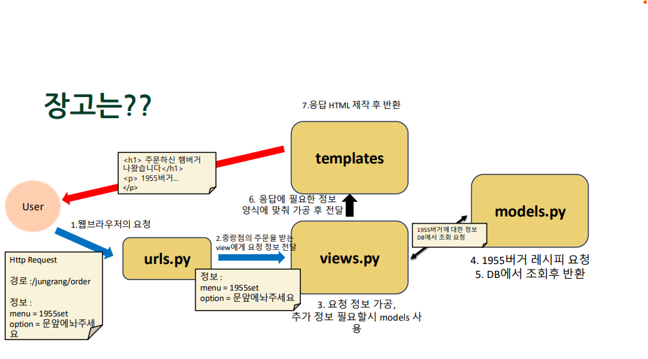

## 1. MTV 패턴

### 장고



- 장고는 model, template, view로 MTV 패턴이다.
- `urls.py`: view 목적지를 찾아 전달
  - `http:// macdonald:8000/jungrang/order?menu=1955set&option=문앞에놔주세요`
- `views.py`: 흐름 제어 (카운터)
  - 정보를 가공해 templates에 넘겨준다.
  - 필요한 경우 models를 호출해 DB에서 정보를 가져온다.
- `models.py`: 데이터 저장, 검색, 관리 (주방)
- `templates`: 응답 내용 관리 (배달 기사)
  - html코드가 들어있다.

## 2. 장고 프로젝트 구조

### 프로젝트와 어플리케이션

- 프로젝트: 우리가 장고로 만드는 소프트웨어 전체
- 어플리케이션: 프로젝트 내에서 기능별로 쪼개 놓은 단위
  -> 하나의 프로젝트는 보통 여러 개의 어플리케이션으로 이루어진다.

### 프로젝트 구조

project

- config
  - `__init__.py`
  - `settings.py`: 장고 설정에 관한 내용
  - `urls.py`: path를 확인해서 알맞은 어플리케이션의 뷰로 연결해준다.
  - `asgi.py`: DB 데이터 조회, 저장, 수정, 삭제
  - `wsgi.py`: ,,
- `manage.py`: 터미널을 이용해 미리 작성된 명령을 실행할 수 있게 해준다.

## 3. 실습

- cmd 에서 시작한다.

1. 가상환경 생성
   `python -m venv venv`
2. 가상환경 실행
   `cd venv\Scripts`
   `activate`
3. 장고 설치
   `pip install django`

- 버전 확인하기
  `django-admin --version`

4. 장고 프로젝트 시작

- 프로젝트 폴더 `project` 만들고 시작
  `cd ..`
  `cd ..`
  `mkdir project`
  `cd project`
- config 폴더 아래에 프로젝츠에서 사용할 settings.py, urls.py 생성하기
  `django-admin startproject config .`

5. 장고 프로젝트 실행
   `python manage.py runserver`
6. settings.py 변경

- LANGUAGE_CODE = ‘ko-kr’
- TIME_ZONE = ‘Asia/Seoul’

7. 어플리케이션 생성하기

- questions 폴더 안에 models.py, views.py 생성된다.
  `django-admin startapp questions`

8. settings.py 앱 등록하기

- settings.py에 우리가 만든 questions
  app을 등록해줘야한다.
- INSTALLED_APPS 에 다음을 추가한다.
  `'questions.apps.QuestionsConfig'`

9. urls.py 에 다음을 추가한다.
   `from questions import views`

- urlpatterns 리스트에 다음을 추가한다.
  `path(’questions/’, views.index),`

10. views.py 에 다음 함수를 추가한다.

```def index(request):
      return render(request, ‘index.html’)
```

11. templates 만들기

- questions > templates > index.html 추가
- 127.0.0.1:8000/questions/ 를 확인해보자.
