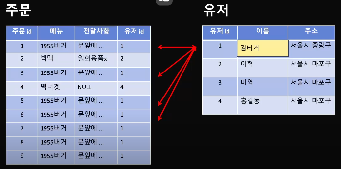
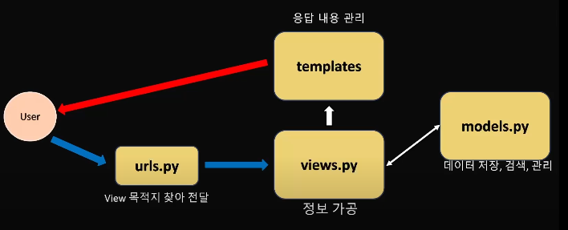

# 주제: 데이터베이스와 장고 모델 사용법

## 1. 데이터 베이스 개념 소개

### 데이터 베이스 (DBMS)

: 정보를 저장하고 관리하는 곳
-> 여러 데이터를 한군데에 모아놓고 필요할 때 원하는 것만 꺼내서 쓰거나 (양식에 맞춰) 분리할 수 있는 것이다.

### 관계형 데이터베이스 (RDBMS)

: 데이터를 엑셀처럼 가로(row) 세로(column) table에 저장하는 것이다.

- 예시> 학회원 table
  - 학번, 이름, 주소, 평균학점, 전화번호
  - 여기서 {학번, 이름, 주소}를 뽑아보자. => **SQL 문법** 사용
    - `SELECT (학번, 이름, 주소) from 학회원 WHERE 이름=유진`
    - `SELECT (학번, 이름, 주소) from 학회원 WHERE 주소=서울시 마포구`

### 기본 키 (Primary Key)

- 기본 키의 조건
  - 1. 고유한 값,
  - 2. 잘 변경되지 않는 값,
  - 3. 모든 row가 가지는 값 (not NULL)
- ex> name은 동명이인인 경우를 선택해내지 못하므로 기본키가 될 수 없고, 고유한 값인 id가 기본키가 될 수 있다.

### 외래 키 (Foreign Key)

- ex> 만약 한 table에 모든 정보가 들어있은데, `이름="유진"`을 `이름="버거"`로 바꾸려고 한다. 그러면 "유진"에 해당하는 여러 데이터에서 모두 하나씩 바꿔주어야하므로 비효율적이다.
  - 그렇다면 `이름`을 *외래키*로 설정하여 원래 table에 참조하는 것이 값 변경을 효율적으로 할 수 있게 한다.
  - 
  - **정규화**: 한 table에서 다른 table로 연결시켜주는 것

## 2. 장고 모델과 사용법

### 2-1. `models.py`가 하는 역할

: 데이터 저장, 검색, 관리

- 1. 데이터 베이스 생성
- 2. 데이터 입출력, 양식 변환
- 3. DBMS에 비종속적임

### `models.py`에 **클래스**를 만들어보자.

- _클래스 = 과자틀_
- _객체 = 과자틀로 찍어낸 과자_
- 클래스 안에서 변수, 함수 만들기가 가능하다.
  - 변수 이름 = column 이름
  - `변수명 =` 오른쪽에는 자료형을 선언한다.
- 클래스로 객체를 만들어서 변수나 함수 사용이 가능하다.
- **상속** 개념

### table을 만드는 명령어

- `python manage.py makemigrations`: models.py를 돌면서 변경사항을 migrations 폴더안에 저장해준다.
- `python mange.py migrate`: 가장 최근에 만들어진 migrations 파일을 찾아서 DB table을 만들어준다.
- *config/settings.py*에 어떤 DB를 사용할건지 설정해야한다.

- table을 만들기전 확인하자!
  - column 이름?
  - 들어가는 자료형?
  - NULL이 가능한가?
  - PK는 어떤 column인가?

### 2-2. `views.py`의 역할

: 정보 가공

- views에서는 model 클래스를 이용해서 DB 내용에 접근한다.
- 예시
  - `클래스명.odjects.all()`
  - `클래스명.odjects.get(id='C235094')`
  - `클래스명.odjects.filter(address__contains='마포구')`

## 3. 실습
