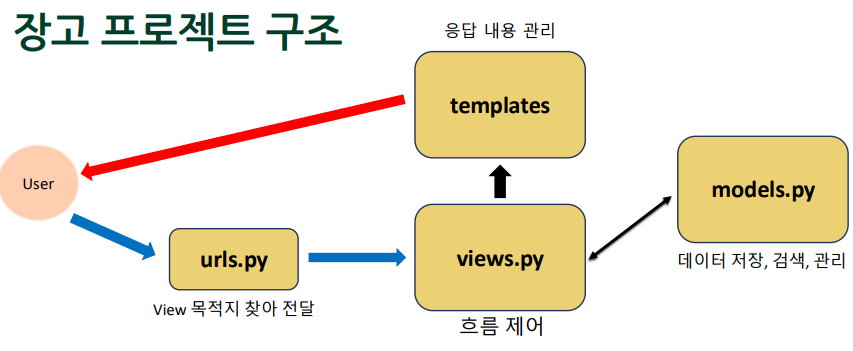

# 주제: Model과 ORM & 장고 template 문법

## 1. Model과 ORM

### Model의 역할

- 1. `models.py`에 클래스를 생성하면, 장고가 클래스를 토대로 DB 테이블을 생성해준다.

  ```python
  from django.db import models

  class Question(models.Model):
  subject = models.CharField(max_length=200)
  content = models.TextField() # 내용 길이를 예측하기 힘들 때
  created_date = models.DateTimeField()
  ```

- 2. DB 테이블에서 값을 조회할 때 `models.py`에 만들어놓은 클래스의 객체에 값을 담아 반환해준다. -> 하나의 튜플로.
  - ex> `Id = 'C211xxx', name = '유진', address = '서울시 마포구', birth_date = '2000-01-01'`

### Class와 객체

- **Class**: `models.py`에 만들어놓은 클래스 (과자 틀)
- **객체**: DB에서 정보를 조회하면 만들어지는 객체 (과자)
- 장고는 과자 틀을 보고 DB table을 만든다.

### SQL 이란?

```SQL
INSERT into Student (sid, sname, addr) value (C123456, 김유진, 서울시 어쩌구)
SELECT (sid, name, addr) FROM addr="서울시 어쩌구"
```

### 장고 ORM 사용법

`클래스이름.odjects.~~()`으로 DB에 접근한다.

- `클래스이름.odjects.all()`: 모든 테이블 정보를 객체로 만들어 모든 행을 포함하는 **query set**을 반환한다.
- `클래스이름.objects.get()`: 조건에 맞는 데이터를 객체로 만들어 반환한다.
- `클래스이름.objects.filter()`: *조건*에 맞는 정보들을 객체로 만들어 리스트에 넣어 반환한다.

### 장고 프로젝트 구조 (복습)



## 2. 장고 Template

### 동적 html 생성

```python
def index(request):
  name = 'kim'
  context = {'name' : name}
  return render(request, 'index.html',context)
```

- `render(request, 'html 파일 경로', 딕셔너리)` # index(request) 함수에서 리턴함.

  - `request`: 장고에서 만들어 넣어준 _HTTP request 객체_
  - `'html 파일 경로'`: 응답할 html 이름
  - `딕셔너리`: html 파일에서 사용할 딕셔너리. 원하는 데이터를 담은 것이다.
    - 주의> 딕셔너리의 key값은 문자열이어야 한다.
    - 딕셔너리의 value값은 문자열, 숫자, 딕셔너리, 객체 등 가능하다.

- 템플릿 안의 html 파일에서 key값을 이용해 꺼낼 수 있다.
  - ex> `<p>{{name}}씨 반갑습니다.</p>`

### DB 정보를 전달할 때 (객체 내부 데이터 접근)

- `객체이름.객체변수이름`

  ```python
  # index 함수 내
  student = Student.objects.get(id=C111xxx)
  context = {'student': student}
  # -----------------------------------------
  print(student.id) //C111xxx
  print(student.name) //홍길동
  print(student.address) //서울시 마포구
  print(student.birth_date)

  ```

  ```html
  <h1>{{student.id}}</h1>
  <h1>{{student.name}}</h1>
  <h1>{{student.address}}</h1>
  ```

- 그외 `` 문법: 안에 if, for 파이썬 제어문을 쓸 수 있다.

  ```html
  <ol>
    
    <li>{{student.name}}</li>
    
  </ol>
  ```

## 3. 실습
