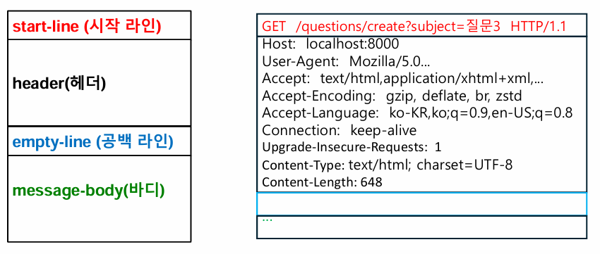
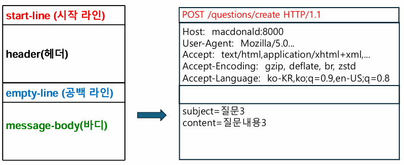
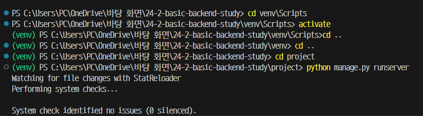
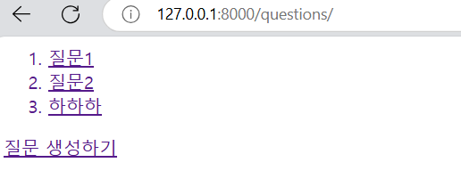
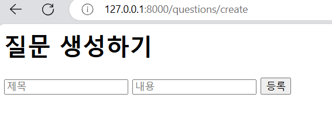
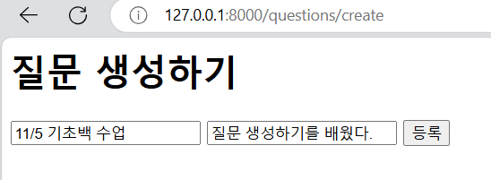
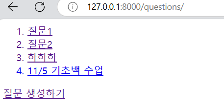
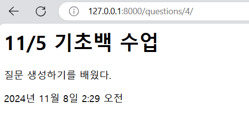
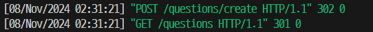

# HTTP Method - form을 이용한 질문 생성

## 1. Http Method

### 브라우저 캐싱

: 요청을 처음 보냈을 때 받아온 html을 **브라우저 안에 저장**을 해놓고, 다음에 같은 요청이 들어오면 브라우저 안에 저장해놓았던 것을 보여준다.

### 캐싱을 헤도 되는 (가능한) 요청

- 단순 조회 요청
- 여러번 요청해도 결과가 동일한 경우
- url에 정보를 넣어 전달해도 되는 경우

### 캐싱을 하면 안되는 (불가능한) 요청

- 새로운 리소스 생성 요청
- 요청마다 결과 변경이 가능한 경우
- 민감한 정보를 다루는 경우
  - ex> 로그인할 때 아이디, 비밀번호
  - ex> 중복 저장될 우려가 있는 서류 접수

### HTTP Method

: 해당 요청이 어떤 행동을 수행하는 메세지인지 전달하는 상태 코드 HTTP Request의 **맨 앞에** 나온다.

- `GET` : **단순 조회 요청**
  - 웹 브라우저의 **기본** HTTP Method
  - 브라우저 **캐싱** 기능을 지원한다.
  - 정보 읽기, 검색 요청에 주로 사용된다.
  - url에 정보를 넣어 전달한다.
- `POST` : **새로운 리소스 생성 요청**

  - 기본 지원과 캐싱 기능 지원이 없다.
  - 새로운 요소의 생성과 로그인 등에 사용된다.
  - `Request Body`에 정보가 들어간다.

- `PUT`
- `DELETE`
- `PATCH`
- `OPTIONS`
- `HEAD`

### 웹 통신 흐름

: **client**와 **server**는 `Http Request`와 `Http Response`를 통해 통신한다.

### HTTP Request

: 장고는 HTTP 요청이 들어오면 해당 요청 정보를 python 객체인 `HTTP Request 객체`로 변환해 `view 함수`의 인자로 넘겨준다.

```python
# Model.odjects.create() 으로 DB에 내용을 저장할 수 있다.
def question_create(request):
  question = Question.objects.create(
    subject = request.POST['subject'],
    content=request.POST['content'],
    create_date=timezone.now()
  )

```

- GET
  - 목적지: `localhost:8000`
  - 경로: `/questions/create`
  - 정보: `subject=질문3`
  ```
    GET /questions/create?subject=질문3 HTTP/1.1
    Host: localhost:8000
    User-Agent: Mozilla/5.0...
    Accept: text/html,application/xhtml+xml,...
    Accept-Encoding: gzip, deflate, br, zstd
    Accept-Language: ko-KR,ko;q=0.9,en-US;q=0.8
    Connection: keep-alive
    Upgrade-Insecure-Requests:1
    Content-Type: text/html; charset=UTF-8
    Content-Length: 648
    ...
  ```
- POST

  ```
  POST /questions/create HTTP/1.1
  Host:  macdonald:8000
  User-Agent:  Mozilla/5.0...
  Accept:  text/html,application/xhtml+xml,...
  Accept-Encoding:  gzip, deflate, br, zstd
  Accept-Language:  ko-KR,ko;q=0.9,en-US;q=0.8
  subject=질문3
  content=질문내용3

  ```

### HTTP Request 구성

- GET
  
  - start-line (request-line) : `GET /questions/create?subject=질문3 HTTP/1.1`
  - header : (사진 참고)
  - message-body : 일반적으로 GET 요청에서는 messge body가 없다.
- POST
  
  - start-line (request-line) : `POST /questions/create HTTP/1.1`
  - header : (사진 참고)
  - message-body :
    ```
      subject=질문3
      content=질문내용3
    ```

## 2. Form 태그

: 데이터를 입력받고 전송하기 위한 태그

- `<input/>` 태그에서 데이터를 입력받고, `<form/>` 태그의 `action` 속성의 **url**로 전송한다.
- `<input/>` 태그의 `type` 속성을 이용해 입력받을 데이터의 양식을 정할 수 있다.

```html
<form action="localhost:8000/create" method="post">
  <input type="text" />
  <input type="submit" />
</form>
```

## 3. 실습 : 질문 생성하기 - /question/create

### 1. 127.0.0.1:8000/questions/create url을 입력하면 질문 생성 화면 띄워주기

- urls.py
  - `path(’questions/create’, views.question_create),` 추가
- views.py

  - `question_create(request)` 함수 추가

  ```python
  from django.shortcuts import render,redirect
  from django.utils import timezone
  # 질문을 생성하는 함수
  # Model.odjects.create() 으로 DB에 내용을 저장할 수 있다.
  def question_create(request):
    question = Question.objects.create(
    subject = request.POST['subject'],
    content=request.POST['content'],
    create_date=timezone.now()
    )
  ```

### 2. 질문 생성화면에서등록버튼을누르면 질문을새로생성하고, 목록화면으로 이동시키기

- templates > question_create.html 추가
- question_create.html

  ```html
  <h1>질문 생성하기</h1>
  <form action="/questions/create" method="post">
    
    <input name="subject" type="text" placeholder="제목" required />
    <input name="content" type="text" placeholder="내용" required />
    <button type="submit">등록</button>
  </form>
  ```

- views.py

  - `question_create(request)` 함수 수정

  ```python
  from django.shortcuts import render,redirect
  from django.utils import timezone

  def question_create(request):
    if request.method =='GET':
      return render(request, 'question_create.html')
    elif request.method=='POST':
      question = Question.objects.create(
      subject = request.POST['subject'],
      content=request.POST['content'],
      create_date=timezone.now()
      )
    return redirect('/questions') # redirect 중요!!
  ```

  - **redirect 란?**
    - 사용자를 다른 URL로 리디렉션하는 데 사용된다.
    - `view 함수`나 `URL`이 변경되었을 때 이를 사용자에게 반영하거나, 특정 작업이 완료된 후(예: 데이터베이스에 데이터가 저장된 후) 사용자에게 다른 페이지로 안내할 때 유용하다.
    - ex> `redirect('/path')`

- templates > questions_list.html

  - '질문 생성하기' 링크를 넣어준다.
    `<a href="/questions/create">질문 생성하기</a>`

- 응답 확인하기
  
  - `python manage.py runserver` 실행
  - 127.0.0.1:8000/questions/create 검색
    
    
    
    
    
  - 질문 생성하기 `/questions/create` 페이지에서 쓰고 등록을 눌렀더니.. 새로운 데이터가 생성되므로 **POST request message**가 뜨고, 그 다음에 바로 `/questions` 페이지를 가져오므로 **GET request message**가 뜨는 것을 볼 수 있다.
    
